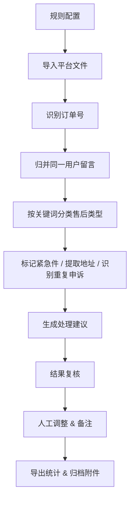

## 1. 产品概述

电商售后自动化整理工具，面向电商售后团队，批量处理退款留言、补发申请与争议原因。通过规则配置驱动自动分类、识别与归并，减少手工整理时间，提升售后处理效率。

- 目标用户：电商售后运营人员、售后主管
- 核心价值：将80%的重复性手工整理工作自动化，释放人力专注于疑难问题处理

## 2. 核心功能

### 2.1 用户角色

| 角色 | 登录方式 | 核心权限 |
|------|----------|----------|
| 售后操作员 | 本地账号 | 配置规则、执行任务、复核结果、导出归档 |
| 售后主管 | 本地账号 | 查看统计、分配复核人、审批异常处理 |

### 2.2 功能模块

1. **规则配置**：售后类型关键词库、紧急件判定规则、重复申诉识别规则、处理建议模板
2. **任务执行**：导入平台导出文件、订单号识别、用户留言归并、自动分类、地址提取、重复申诉检测、处理建议生成
3. **结果复核**：异常件标记、人工复核、备注添加、复核人分配
4. **导出归档**：统计摘要生成、批量改名归档、Excel导出、附件整理

### 2.3 页面详情

| 页面名称 | 模块名称 | 功能描述 |
|-----------|-------------|---------------------|
| 仪表盘 | 数据概览 | 今日处理量、各类型占比、紧急件数量、平均处理时长 |
| 规则配置 | 分类规则管理 | 售后类型增删改、关键词维护、优先级设置 |
| 规则配置 | 紧急件规则 | 紧急关键词、时效规则、特殊标记配置 |
| 规则配置 | 处理建议模板 | 各类型默认建议、模板变量、自定义模板 |
| 任务执行 | 文件导入 | 支持Excel/CSV导入、拖拽上传、导入预览 |
| 任务执行 | 处理进度 | 实时进度条、处理统计、错误提示 |
| 结果复核 | 订单列表 | 分页列表、筛选排序、批量操作 |
| 结果复核 | 订单详情 | 完整留言、分类结果、地址信息、人工编辑 |
| 导出归档 | 统计摘要 | 分类统计、人员绩效、趋势图表 |
| 导出归档 | 批量导出 | Excel导出、附件重命名、归档打包 |

## 3. 核心流程

操作人员先配置分类规则和关键词库，然后导入平台导出的售后文件，系统自动执行订单识别、归并、分类、标记等处理。处理完成后，操作人员复核异常结果并添加人工备注，最后导出统计报表并归档附件。

## 4. 用户界面设计

### 4.1 设计风格

- 主色调：深青色 #0F766E（专业、可靠），搭配琥珀色 #F59E0B 作为紧急件警示色
- 辅助色：蓝灰色系背景，层级分明的卡片式布局
- 按钮风格：圆角8px，悬停有微妙阴影加深效果
- 字体：思源黑体 / PingFang SC，清晰易读的表格字体
- 布局：左侧导航 + 右侧内容区，顶部工具栏
- 图标风格：线性图标，统一2px描边

### 4.2 页面设计概览

| 页面名称 | 模块名称 | UI 元素 |
|-----------|-------------|-------------|
| 仪表盘 | 数据概览 | 统计卡片网格、趋势折线图、分类饼图、紧急件列表 |
| 规则配置 | 分类规则 | 标签页切换、关键词标签、拖拽排序、规则启用开关 |
| 任务执行 | 文件导入 | 拖拽上传区、文件列表、进度条、处理结果摘要 |
| 结果复核 | 订单列表 | 筛选器、数据表格、批量操作栏、分页器 |
| 结果复核 | 订单详情 | 左右分栏、留言时间线、可编辑字段、备注区 |
| 导出归档 | 统计摘要 | 图表组、导出按钮、日期范围选择器 |

### 4.3 响应式

- 桌面端优先设计，最小支持1280px宽度
- 表格区域支持横向滚动
- 侧边栏可折叠以获得更大内容区

### 4.4 动效与交互

- 页面切换使用淡入过渡
- 数据加载时骨架屏占位
- 表格行悬停高亮
- 紧急件有脉冲动画提醒
- 处理进度实时更新动画
