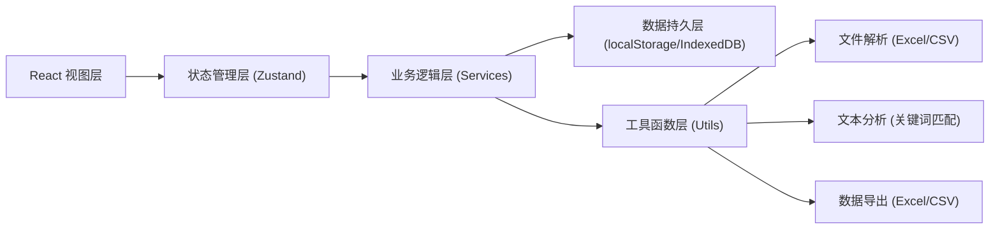
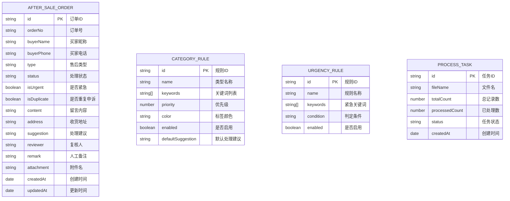

## 1. 架构设计

前端单页应用架构，数据存储使用浏览器本地存储（localStorage + IndexedDB），无需后端服务。所有处理逻辑在前端完成，适合本地单机使用场景。



## 2. 技术描述

- **前端框架**：React@18 + TypeScript
- **构建工具**：Vite@5
- **样式方案**：TailwindCSS@3 + CSS Variables
- **状态管理**：Zustand
- **路由**：React Router@6
- **UI 组件**：Headless UI + 自定义组件
- **图标**：Lucide React
- **图表**：Recharts
- **文件处理**：SheetJS (xlsx) + FileSaver
- **数据存储**：localStorage (配置) + IndexedDB (订单数据)
- **Mock 数据**：内置示例数据用于演示

## 3. 路由定义

| 路由 | 页面 | 功能 |
|-------|------|------|
| / | 仪表盘 | 数据概览、统计图表、快捷操作 |
| /rules | 规则配置 | 分类规则、紧急件规则、处理建议模板 |
| /tasks | 任务执行 | 文件导入、处理进度、结果预览 |
| /review | 结果复核 | 订单列表、订单详情、人工调整 |
| /export | 导出归档 | 统计摘要、批量导出、附件管理 |

## 4. 核心数据模型

### 4.1 数据模型定义



### 4.2 类型定义

```typescript
// 售后订单
interface AfterSaleOrder {
  id: string;
  orderNo: string;
  buyerName: string;
  buyerPhone: string;
  type: AfterSaleType;
  status: OrderStatus;
  isUrgent: boolean;
  isDuplicate: boolean;
  duplicateOf?: string;
  messages: Message[];
  originalAddress?: string;
  newAddress?: string;
  addressChanged: boolean;
  suggestion: string;
  reviewer?: string;
  remark?: string;
  attachments: string[];
  createdAt: string;
  updatedAt: string;
}

// 留言记录
interface Message {
  id: string;
  content: string;
  time: string;
  source: 'buyer' | 'seller' | 'system';
}

// 售后类型
type AfterSaleType = 'refund' | 'reissue' | 'dispute' | 'consult' | 'other';

// 订单状态
type OrderStatus = 'pending' | 'processing' | 'reviewing' | 'completed' | 'exception';

// 分类规则
interface CategoryRule {
  id: string;
  name: string;
  type: AfterSaleType;
  keywords: string[];
  priority: number;
  color: string;
  enabled: boolean;
  defaultSuggestion: string;
}
```

## 5. 核心处理流程

### 5.1 文件导入与解析

1. 用户上传 Excel/CSV 文件
2. 使用 SheetJS 解析文件内容
3. 自动识别列名映射（订单号、买家昵称、留言内容等）
4. 预览前10条数据，用户确认列映射
5. 数据入库（IndexedDB）

### 5.2 自动处理引擎

1. **订单号识别**：正则匹配常见订单号格式
2. **用户归并**：按买家昵称/手机号归并同一用户的多条留言
3. **关键词分类**：按优先级匹配分类规则，确定售后类型
4. **紧急件标记**：匹配紧急关键词库，标记紧急件
5. **地址提取**：正则识别地址变更内容，提取新旧地址
6. **重复申诉识别**：基于订单号+时间窗口判断重复申诉
7. **生成建议**：根据售后类型匹配默认处理建议模板

### 5.3 导出归档

1. 筛选需要导出的订单
2. 生成 Excel 报表（含分类统计）
3. 附件批量重命名（订单号_类型_日期格式）
4. 打包下载
